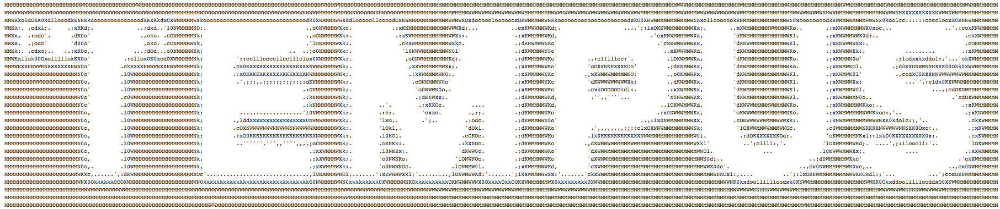

# Test Strategy - Image Conversion

### Automation
* In order to have concrete expected results, the conversion must first be validated manually. Across all image types and various dimensions.
    * See: [Image Conversion Examples](../pages/ASCII-Generator-Testing-Image.md).
    * Once a conversion result has been verified manually and signed off on by cross-functional team members, the generated result can be saved as a expected result file that is checked in and used for comparison in automated tests.
        * Example:
          * Image input: 
            - 
          * Verified output:
            - 
    * As long as the input image does not change, the output image should not change either. The only ways it would change are (a) an intentional system update/code change, or (b) a defect. 
      - If it is (a), the input/output need to be validated manually again, and the test updated. 
      - If it is (b), the test should fail and the defect investigated before merging the change.
    * There will be some legwork to initially set up the expected data, but the payoff will be immense for subsequent build verifications.
    * In this example, there are only a few options for urls, uploaded images, and file types, so all comparisons can be built relatively easily.

### Manual Verification
  * As stated above, manual verification & sign-off is important for a whole host of reasons. Once a feature is deemed "accepted", we can now assume the image conversion outputs are golden, and can be used for long-term test automation purposes.
  * Exploratory testing can be focused on new features + navigation, concurrency, etc. 
      - Examples: What happens if I use the browser back button, then forward, then backward? What happens if two people try to convert the same image at the same time?

### Monkey testing (and other miscellaneous)
  * use monkey testing to slam page with random inputs and checks for errors
  * See Non-functionals
  * Load
  * Security
  * Hold onto image for 20+ minutes
