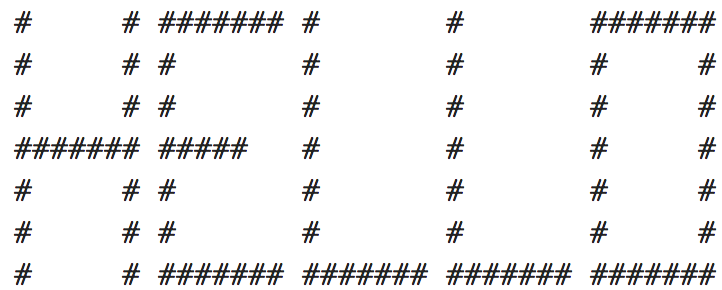

# Test Strategy - Text Conversion

### Automation
* In order to have concrete expected results, the conversion must first be validated manually. Across all fonts, line widths, and text types.
    * See: [Text Conversion Examples](./pages/ASCII-Generator-Testing-Text.md).
    * Once a conversion result has been verified manually and signed off on by cross-functional team members,
        the text result can be saved in a string or a file for comparison in automated tests.
        * Example:
          * Text input: "HELLO"
          * Verified output:
          
    * As long as the input text does not change, the output text should not change either. The only ways it would change are (a) an intentional system update/code change, or (b) a defect. 
      - If it is (a), the input/output need to be validated manually again, and the test updated. 
      - If it is (b), the test should fail and the defect investigated before merging the change.
    * The above output can be saved as a file or in a variable to be read in at runtime.
    * The input and expected result can be verified in automated tests continuously.
    * There will be some legwork to initially set up the data, but the payoff will be immense for subsequent build verifications.
    * In this example, there are only a few preset options for font and input character types, so all comparisons can be built relatively easily. If more fonts or other inputs are introduced in the future, it may make sense to look at pairwise testing, to trim down the number of examples.

### Manual Verification
  * As stated above, manual verification & sign-off are crucial. Once a feature is deemed "accepted", we can now assume the text conversion outputs are golden, and can be used for long-term test automation purposes.
  * Exploratory testing can be focused on new features + navigation, concurrency, etc. 
      - Examples: What happens if I use the browser back button, then forward, then backward? What happens if two people try to convert the same text at the same time?
